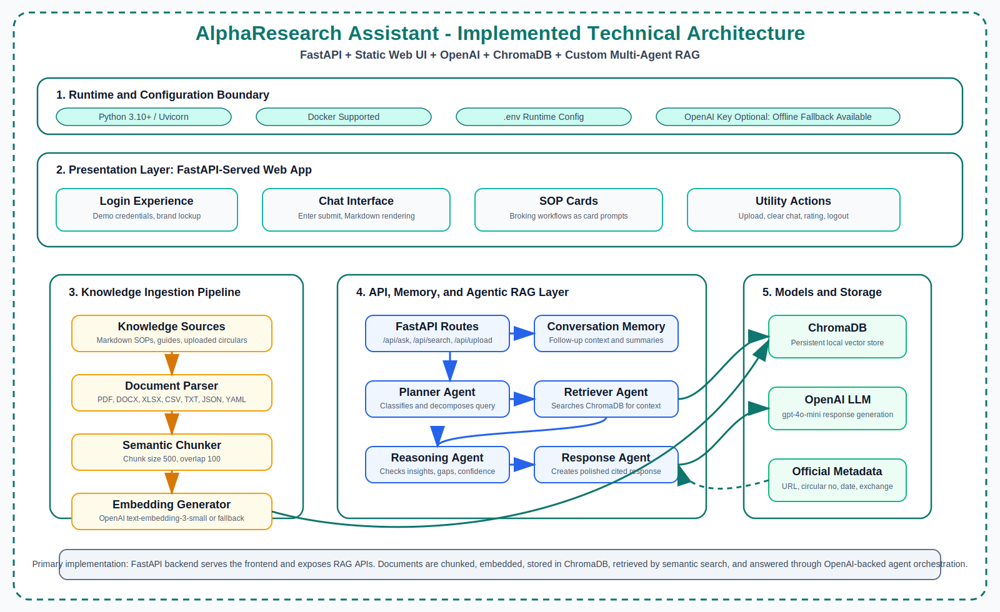

# AlphaResearch Assistant

**Capstone Project: Gen AI and Agentic AI Assistant for Indian Broking Operations**

AlphaResearch Assistant is a production-style Retrieval-Augmented Generation (RAG) application for Indian broking, trading, settlement, compliance, and exchange operations. It combines a polished web assistant, document ingestion, Chroma vector search, OpenAI-powered generation, and a lightweight multi-agent reasoning layer.

The application is designed as a capstone demonstration of how Gen AI can answer operational questions using a controlled knowledge base, uploaded circulars, SOPs, and official-source metadata.



## Key Capabilities

- Professional web assistant branded as **AlphaResearch Assistant**.
- Login screen with demo credentials visible for evaluator convenience.
- SOP cards for major broking workflows.
- Chat interface with Enter-to-submit, response ratings, clear chat, and follow-up memory.
- RAG answers from markdown knowledge base and uploaded documents.
- Official circular metadata support: `source_url`, `circular_no`, `date`, `exchange`, and `section`.
- Upload and index PDFs, DOCX, XLSX, CSV, TXT, JSON, YAML, and Markdown files.
- ChromaDB-backed persistent vector store.
- OpenAI generation with offline fallback for demo resilience.
- FastAPI backend serving both API and frontend.
- Docker support for portable deployment.

## Default Demo Login

- Login ID: `sainiashit31@gmail.com`
- Password: `admin@123`

This login is intentionally client-side for capstone/demo usage only. It should be replaced with server-side authentication before production use.

## Project Structure

```text
broking-ai-assistant/
├── app/
│   ├── main.py
│   ├── config.py
│   ├── api/
│   ├── agents/
│   ├── core/
│   ├── scripts/
│   └── services/
├── frontend/
│   ├── index.html
│   ├── app.js
│   └── styles.css
├── knowledge-base/
├── data/
│   ├── documents/
│   ├── embeddings/
│   └── official_sources.json
├── docs/
│   ├── CAPSTONE_PROJECT_REPORT.md
│   ├── TECHNICAL_ARCHITECTURE.md
│   ├── USER_GUIDE.md
│   ├── API.md
│   ├── DEPLOYMENT.md
│   └── assets/
├── docker/
├── requirements.txt
├── .env.example
└── README.md
```

## Quick Start

```powershell
python -m venv venv
venv\Scripts\activate
pip install -r requirements.txt
copy .env.example .env
```

Add your OpenAI key in `.env`:

```env
OPENAI_API_KEY=your_openai_api_key_here
OPENAI_MODEL=gpt-4o-mini
OPENAI_EMBEDDING_MODEL=text-embedding-3-small
```

Ingest the bundled knowledge base:

```powershell
python -m app.scripts.ingest_documents --source ./knowledge-base
```

Run the app:

```powershell
python -m uvicorn app.main:app --host 127.0.0.1 --port 8000
```

Open:

```text
http://127.0.0.1:8000
```

API docs:

```text
http://127.0.0.1:8000/docs
```

## Docker Run

```powershell
copy .env.example .env
docker compose -f docker/docker-compose.yml up --build
```

Open `http://127.0.0.1:8000`.

## Main API Endpoints

- `GET /health` - root health check.
- `GET /api/health` - API health check.
- `POST /api/ask` - ask the RAG assistant a question.
- `POST /api/search` - retrieve relevant chunks.
- `POST /api/documents/upload` - upload and index a document.
- `POST /api/documents/batch-ingest` - ingest a directory.
- `GET /api/stats` - inspect model/vector-store configuration.
- `GET /api/official-sources` - list official-source registry entries.

## Documentation

- [Capstone Project Report](docs/CAPSTONE_PROJECT_REPORT.md)
- [Technical Architecture](docs/TECHNICAL_ARCHITECTURE.md)
- [User Guide](docs/USER_GUIDE.md)
- [API Reference](docs/API.md)
- [Deployment Guide](docs/DEPLOYMENT.md)
- [Submission Checklist](docs/SUBMISSION_CHECKLIST.md)

## Notes for Evaluators

This project demonstrates a realistic Gen AI pattern for a regulated domain. The bundled markdown knowledge base is curated capstone content. For compliance-grade operation, official SEBI/NSE/BSE/MCX circulars should be ingested with full provenance metadata and periodically refreshed.

The assistant is educational and operational-support focused. It does not provide personalized investment, legal, or tax advice.
