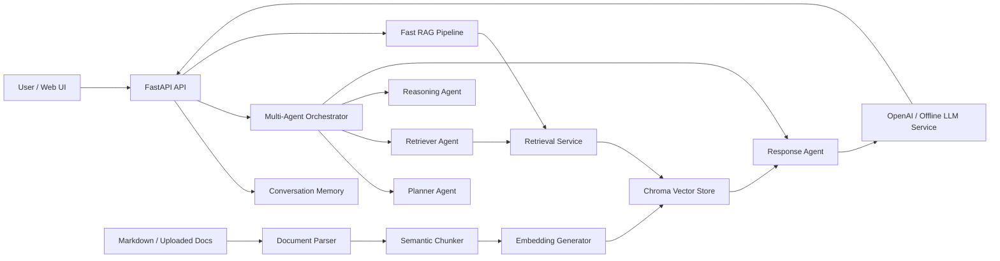

# Architecture

This file is a short architecture summary. For the full capstone architecture document, see [TECHNICAL_ARCHITECTURE.md](TECHNICAL_ARCHITECTURE.md).

AlphaResearch Assistant is a local-first RAG and agentic AI system for Indian broking knowledge.

Key behavior:

- OpenAI mode is used when `OPENAI_API_KEY` contains a real key.
- Offline demo mode uses deterministic local hashing embeddings and extractive answers, so the capstone can run without external credentials.
- Knowledge-base ingestion is idempotent because vector rows are upserted with stable chunk ids.
- The frontend is served directly by FastAPI for a simple one-command demo.
- Direct follow-up handling supports prompts such as "summarize above in 10 lines".
- Official circular ingestion is supported through `data/official_sources.json` and `python -m app.scripts.ingest_official_file`.
- Chunks can keep `source_url`, `circular_no`, `date`, `exchange`, and `section` metadata for citation-grade answers.

## Source Provenance

The bundled markdown knowledge base is curated capstone content. For compliance-grade usage, ingest official files from regulator/exchange sources and cite those official chunks in answers.

Supported provenance fields:

- `source_url`
- `circular_no`
- `date`
- `exchange`
- `section`
- `category`
