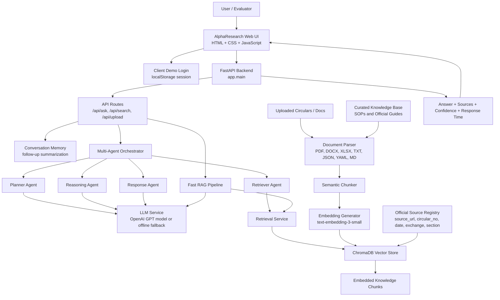
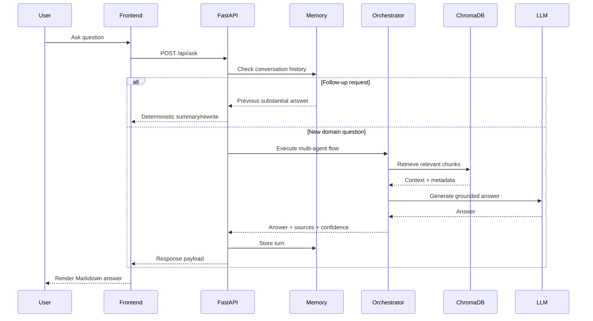

# Technical Architecture

## Architecture Diagram

This is the implementation-matching architecture diagram for AlphaResearch Assistant:

The originally supplied reference image is preserved at `assets/Technical_Architecture.png`, but it should be treated as a reference image because it shows Streamlit, Gemini, LangGraph, and Langfuse. The actual AlphaResearch implementation uses FastAPI, a static web frontend, OpenAI, ChromaDB, and a custom multi-agent orchestrator.

Implemented system architecture:

## Layered Design

### 1. Presentation Layer

Files:

- `frontend/index.html`
- `frontend/styles.css`
- `frontend/app.js`

Responsibilities:

- Login and logout flow.
- Chat interface.
- SOP card selection.
- Upload control.
- Clear chat.
- Markdown rendering.
- Response rating.
- Local chat history and session ID.

### 2. API Layer

Files:

- `app/main.py`
- `app/api/routes.py`
- `app/api/schemas.py`

Responsibilities:

- Serve frontend.
- Provide REST endpoints.
- Validate request and response payloads.
- Manage chat memory.
- Route questions to direct follow-up logic, multi-agent pipeline, or RAG pipeline.

### 3. Agentic Layer

File:

- `app/agents/orchestrator.py`

Responsibilities:

- Plan complex queries.
- Retrieve context for subtasks.
- Reason over retrieved snippets.
- Generate professional answers.
- Return sources, plan, confidence, and retrieval summary.

### 4. RAG Layer

Files:

- `app/core/rag_pipeline.py`
- `app/services/retrieval_service.py`
- `app/services/llm_service.py`
- `app/core/embeddings.py`
- `app/core/vector_store.py`
- `app/core/text_chunking.py`

Responsibilities:

- Convert user question into embedding search.
- Retrieve relevant chunks from ChromaDB.
- Format context for the LLM.
- Generate answer using OpenAI or offline fallback.
- Format source citations.

### 5. Knowledge and Storage Layer

Folders and files:

- `knowledge-base/`
- `data/documents/uploads/`
- `data/embeddings/chroma_db/`
- `data/official_sources.json`

Responsibilities:

- Store curated domain documents.
- Store uploaded files.
- Persist vector embeddings.
- Preserve official circular metadata.

## Request Lifecycle

## Document Ingestion Lifecycle

## Main Runtime Components

| Component | Technology | Purpose |
| --- | --- | --- |
| Web UI | HTML, CSS, JavaScript | Professional assistant interface |
| Backend | FastAPI | API and static frontend serving |
| LLM | OpenAI GPT model | Response generation and reasoning |
| Embeddings | OpenAI `text-embedding-3-small` | Semantic representation of chunks |
| Vector DB | ChromaDB | Persistent local similarity search |
| Document Parsing | pdfplumber, python-docx, openpyxl, PyYAML | Multi-format ingestion |
| Deployment | Docker, Uvicorn | Portable local execution |

## Security and Governance

- `.env` is used for runtime secrets and configuration.
- `.env.example` is safe for repository sharing.
- Demo login is frontend-only and not production security.
- Uploaded files are stored locally under `data/documents/uploads`.
- Official-source metadata improves traceability but depends on correct ingestion inputs.

## Production Hardening Recommendations

- Replace demo login with server-side authentication.
- Add RBAC for admin upload and ordinary chat users.
- Add audit logs for document uploads and answers.
- Add OCR for scanned PDFs.
- Add automated source refresh from official regulator/exchange websites.
- Add tracing and quality evaluation for prompts, latency, and answer faithfulness.
- Deploy behind HTTPS and a reverse proxy.
